# Architecture — ESB/SOA-Dashboard

> Status: describes the code as of branch `master`, frontend version `1.2.114`.
> Written in English; German domain terms (`Umgebung`, `Logpunkt`, `Queue`, `Job`) are kept
> verbatim because they are identifiers in the code and in the UI.

## 1. Purpose and scope

The ESB/SOA-Dashboard is an operations tool. It gives support and operations staff a read/write
view onto a running SOA/ESB installation:

- **Logpunkte** — the trace records the ESB writes for every service call, searchable by time
  window, Message-Id, Sender-FQN, Service-Namespace, Operation, Process-Instance-Id, …
- **Messages** — undelivered/expired/rejected messages, including their payload
- **Queues** — AQ queue tables and the messages sitting in them
- **Statistics** — aggregated call/fault/timing statistics rendered with `dc.js` + `crossfilter`
- **Checkalive** — results of the SOA's own availability runs
- **Housekeeping-Jobs** — bulk operations ("resend", "delete", "nur Log") over a saved selection
  of messages, persisted as job files on a local disk

The system deliberately holds **no database of its own**. Every piece of business data is fetched
live from the SOA's REST interface; the only state the dashboard owns is user session, UI
configuration, and job files.

### Architecturally significant requirements

| # | Requirement | Consequence |
|---|---|---|
| R1 | Authenticate against ActiveDirectory/LDAP | Needs a Node process — LDAP libraries depend on Node's `net`, unavailable in the browser |
| R2 | One build must serve several SOA stages (DEV/TEST/PROD) | Target URL is runtime configuration (`Umgebung`), not build-time |
| R3 | Deployable as a plain static drop plus one process, or as a single `.exe` | Backends are bundled with `ncc` and packaged with `pkg` |
| R4 | Job files and model data live on a local/served filesystem | Second backend with filesystem access, strictly path-fenced |
| R5 | Must be demoable/developable without a SOA | Global mock mode replaces every REST client with fixtures |

---

## 2. C4 Level 1 — System context

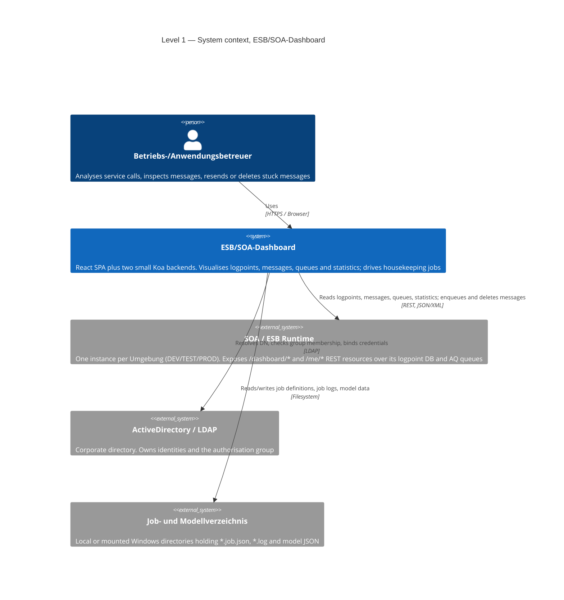

**Key point:** the dashboard is a *client* of the SOA in the strict sense. It never talks to the
SOA's database directly and never holds a replica of SOA data.

---

## 3. C4 Level 2 — Containers

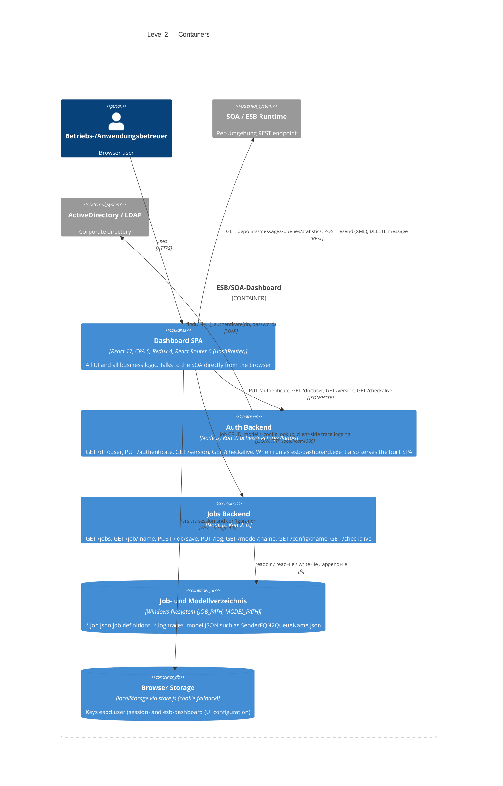

### Container responsibilities

| Container | Source | Responsibility | Deliberately *not* responsible for |
|---|---|---|---|
| Dashboard SPA | `frontend/` | All domain logic: filtering, aggregation, timeline construction, job orchestration | Authentication against LDAP; filesystem access |
| Auth Backend | `server.js`, `backend-auth/` | LDAP DN resolution, group-based authorisation, credential bind, version endpoint, optional static hosting of the SPA | Session storage — it is completely stateless, a `kill` is a safe stop |
| Jobs Backend | `backend-jobs/` | Path-fenced filesystem I/O for jobs, logs, models, and exposing selected config values | Authentication — it has none (see §7.2) |

### Why the SPA calls the SOA directly

There is no API gateway of the dashboard's own. `frontend/src/logic/api/rest-api-esb.js` issues
`axios` calls straight from the browser to the URL configured for the selected `Umgebung`. This
keeps the backends trivial and stateless (R3) and makes switching stage a pure client-side
concern (R2) — at the cost of requiring CORS/network reachability from the client to every SOA
stage.

---

## 4. C4 Level 3 — Components

### 4.1 Dashboard SPA

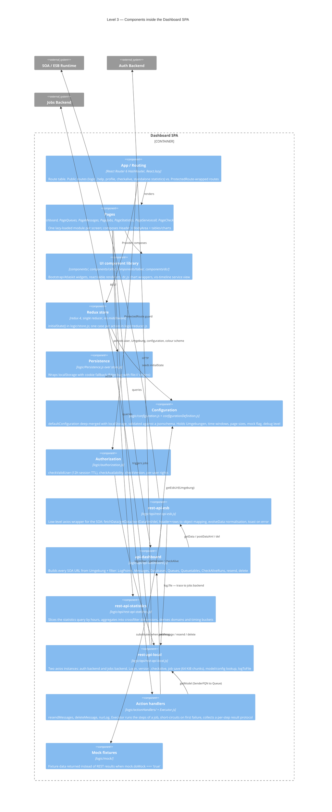

Notable structural facts:

- **The Redux store is deliberately thin.** It carries *filter state* (Umgebung, date, from/to,
  search type and value, message type, view, colour scheme) and the user session — not fetched
  data. Data lives in component state, fetched via callback-style `getXxx(filter, cb)` APIs.
- **`Executor` is the job engine.** Every housekeeping operation is a sequence of named steps
  (`ermittle Queuename` → `get Message` → `resend Message` → `delete Message` → `check Message
  deleted`). It stops at the first failing step and returns a numbered protocol, which is what the
  UI shows and what gets appended to the job log.
- **Mock mode is a system-wide switch,** not a test double injected per call site. `mock.doMock`
  is read inside the API modules and inside `authorization.js`, so a mocked build logs in with a
  synthetic user and serves fixtures.
- **`log.file`** routes selected client-side traces (`rest-api-esb`, `rest-api-statistics`) to
  `PUT /log` on the jobs backend, i.e. the browser writes trace files onto the operator's disk.

### 4.2 Auth Backend

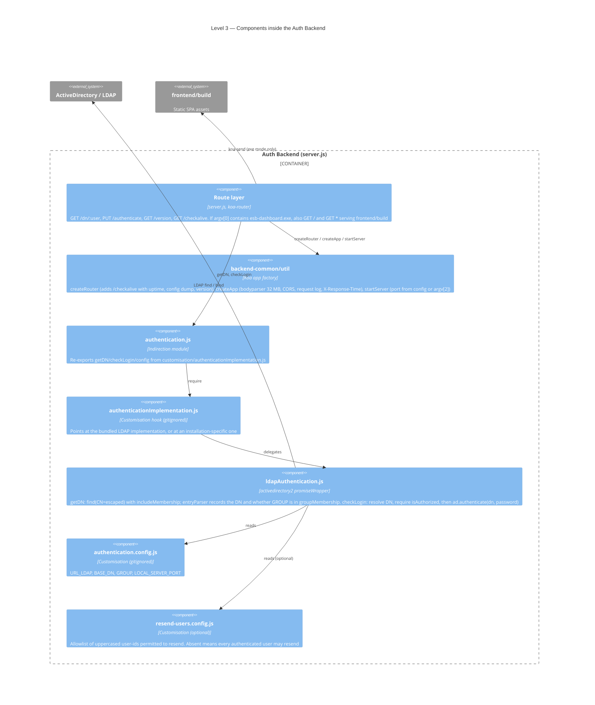

The `authentication.js` → `customisation/authenticationImplementation.js` hop is the extension
point: an installation that does not use ActiveDirectory implements `getDN` and `checkLogin`
itself and never touches `backend-auth/ldap/`.

LDAP filter values are escaped per RFC 4515 (`escapeFilterValue`) before being interpolated into
`CN=…`, so a user-id like `a*` cannot turn the lookup into a wildcard search.

### 4.3 Jobs Backend

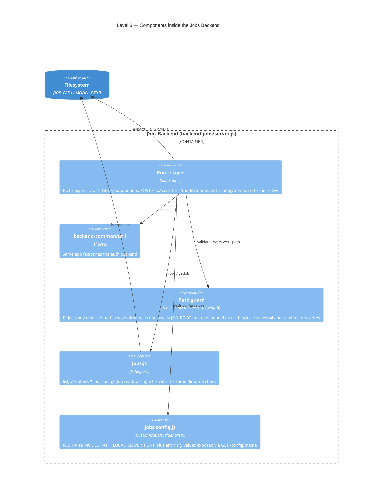

`JOB_ROOT` is created on startup if missing (`fs.mkdir`, `EEXIST` tolerated), then the server
starts.

---

## 5. Runtime views

### 5.1 Login

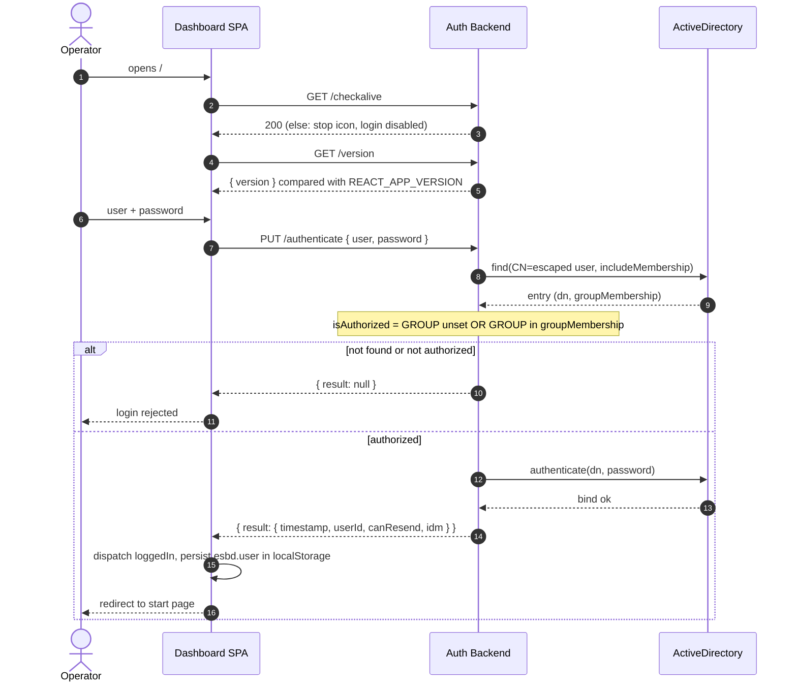

The returned object *is* the session: there is no token and no server-side session store.
`checkValidUser` treats it as valid for 12 hours from `timestamp`, and `ProtectedRoute` re-checks
it on every protected navigation. A restart of the auth backend logs nobody out.

### 5.2 Querying logpoints

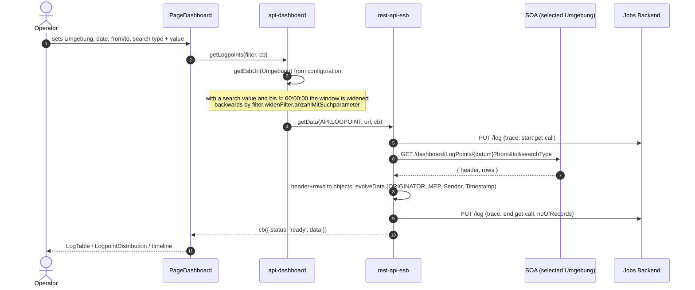

On an axios error `fetchData` raises a non-auto-closing toast, calls back with
`status: 'Keine Daten abgeholt'`, and returns `{ abort: true }` — errors surface in the UI rather
than being swallowed, and no partial render is attempted.

### 5.3 Housekeeping: resending a queued message

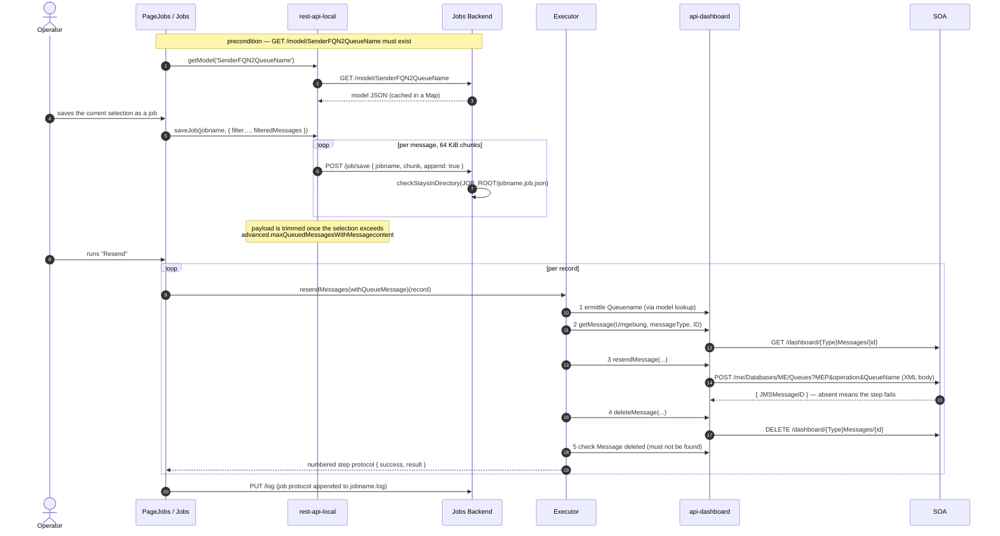

Two independent gates protect resending: `canResend` on the session (from
`resend-users.config.js`) and the fact that `checkAliveFile` — and therefore the whole jobs
backend integration — is only probed for users who have it.

---

## 6. Deployment views

### 6.1 Development

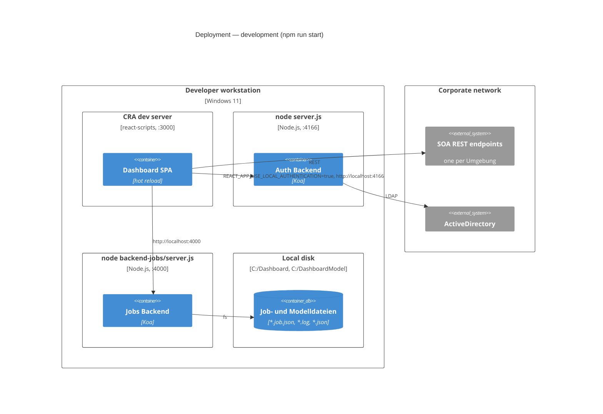

### 6.2 Server deployment (`build:all`)

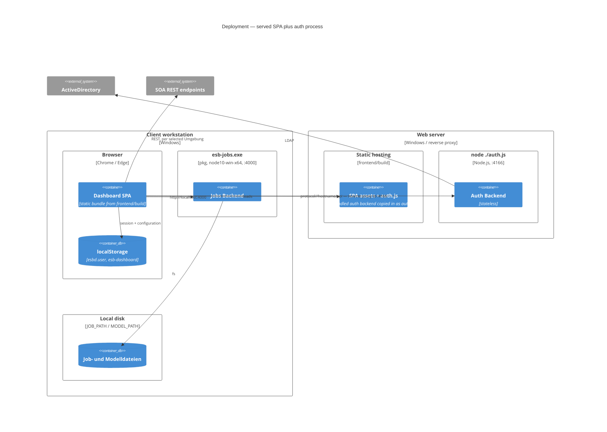

`rest-api-local.js#getLocalURL` encodes exactly this split:

| Target | `REACT_APP_USE_LOCAL_AUTHENTICATION` | Resulting base URL |
|---|---|---|
| Auth backend | `true` | `http://localhost:${REACT_APP_AUTHENTICATION_PORT}` |
| Auth backend | anything else | `${window.location.protocol}//${window.location.hostname}/api` |
| Jobs backend | irrelevant | `http://localhost:${REACT_APP_FILE_PORT}` |

The jobs backend is therefore **always** a per-workstation process; the auth backend can be
central behind a reverse proxy that maps `/api` onto port 4166.

### 6.3 Standalone `esb-dashboard.exe`

`esb-dashboard.exe` packs the SPA (`pkg.assets: frontend/build/**/*`) together with the auth
backend. It detects its own mode via `process.argv[0].indexOf('esb-dashboard.exe') > -1` and, in
that case, registers `GET /` and `GET *` to `koa-send` from `frontend/build`. The whole dashboard
is then reachable at `http://localhost:4166`, no web server required.

### 6.4 Build pipeline

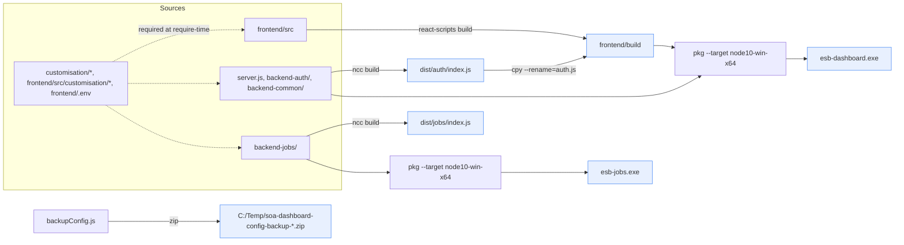

`npm run build:all` = `backup:config` → `pkg:all` → `ncc:build` → `postbuild:all` (copy
`dist/auth/index.js` into `frontend/build` as `auth.js`). Deploying then means copying
`frontend/build` and adding `node ./auth.js` to the server's startup.

---

## 7. Cross-cutting concerns

### 7.1 Configuration — four distinct layers

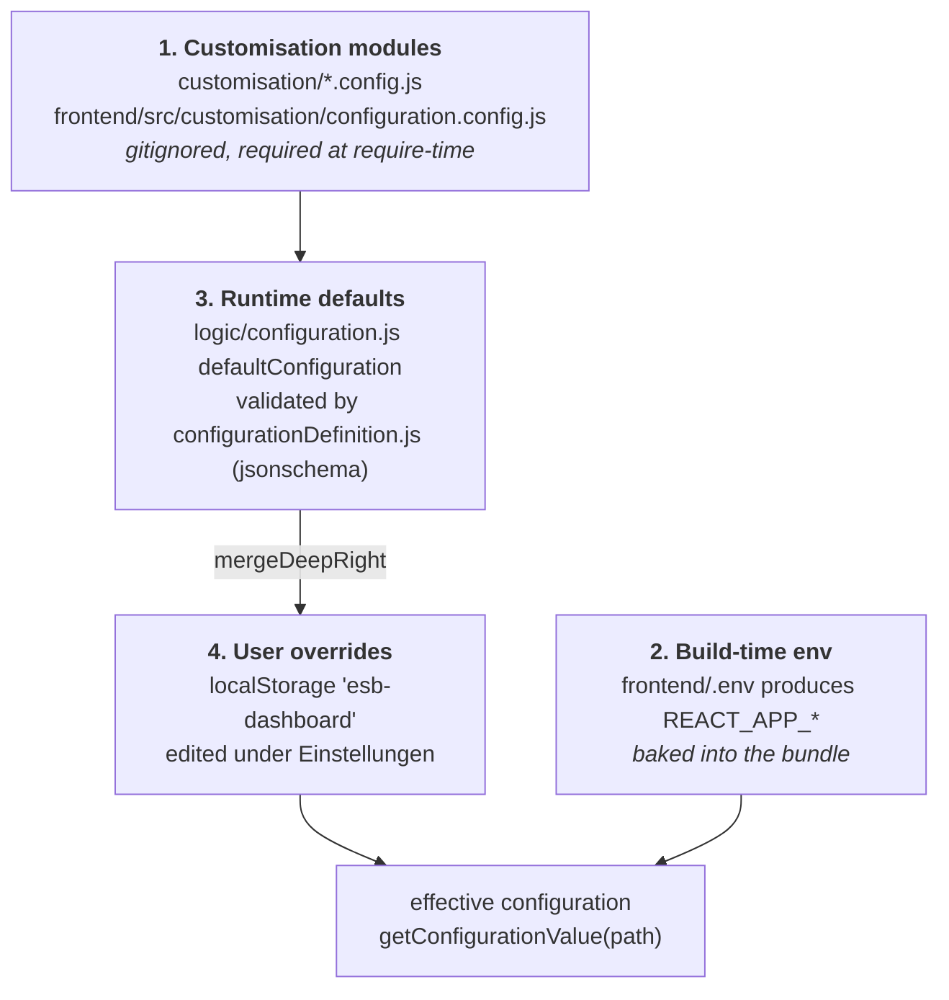

Consequences worth knowing:

- Missing customisation files make the servers and the frontend build **fail at startup**, by
  design — there is no silent fallback. `customisation/README.md` and
  `frontend/src/customisation/README.md` are the contracts.
- Because `REACT_APP_*` is build-time, changing ports or the local-auth flag requires a rebuild;
  changing the list of `Umgebungen`, time windows, or page sizes does not.
- `defaultConfiguration.version` (currently `6`) is the migration marker for stored
  configurations.

### 7.2 Security model

| Aspect | Implementation | Consequence / limitation |
|---|---|---|
| Authentication | LDAP bind through the auth backend | Password is sent to the auth backend in the request body — TLS termination is the deployment's responsibility |
| Authorisation (access) | `GROUP` membership checked in `entryParser`; empty `GROUP` means everyone | Enforced at login only |
| Authorisation (resend) | `resend-users.config.js` allowlist produces `canResend` on the session | Absent file means every authenticated user may resend |
| Session | Plain JSON object in `localStorage`, 12 h TTL checked client-side | No token, no server-side revocation. The `TODO` in `authorization.js` marks JWT as the intended evolution |
| Route protection | `ProtectedRoute` + `checkValidUser` | Client-side only — the SOA REST endpoints are called directly by the browser and are not gated by the dashboard |
| Path traversal | `checkStaysInDirectory` / `path.dirname === root` in both the jobs server and `jobs.js` | Solid against `../`, but the jobs backend has **no authentication at all** — it is safe only because it binds a localhost port on the operator's own machine |
| LDAP injection | `escapeFilterValue` (RFC 4515) on the user-id | Wildcards and parentheses cannot leak into the filter |
| CORS | `@koa/cors()` with defaults on both backends | Wide open; acceptable for localhost/intranet, worth narrowing if the auth backend is exposed |

### 7.3 Error handling and observability

- **Backends:** `app.on('error')` logs to the console; each request logs method, URL and
  `X-Response-Time`, with `/checkalive` and `/log` filtered out to keep the console readable.
  `GET /checkalive` returns uptime, the full config dump and the version — it is both the liveness
  probe used by the SPA and the diagnostic endpoint.
- **Frontend:** `log.js` wraps the `debug` package with a numeric level (`debug.level`) and a
  namespace filter (`debug.namespaces`, default `ESBD:*`), both runtime-configurable. API errors
  become `react-toastify` notifications that do not auto-close. `Statusleiste` shows a rolling
  `infos` list fed by `sendStatusInfo`.
- **Job tracing:** `logToFile(destination)` posts to `PUT /log`, appending one JSON object per
  line to `<destination>.log` in `JOB_PATH`.

### 7.4 Performance-relevant decisions

- Statistics queries are **sliced** into chunks of `advanced.sliceFetchStatisticsHours` (default
  12 h) and aggregated client-side with `crossfilter2`, keeping single responses bounded.
- Job saving streams in **64 KiB chunks** via repeated `POST /job/save { append: true }`; the
  bodyparser limit is raised to 32 MB accordingly.
- Above `advanced.maxQueuedMessagesWithMessagecontent` records, message payloads are dropped from
  the saved job and reduced to the extracted `senderFQN`.
- All pages are `React.lazy` code-split behind a single `Suspense` boundary.

---

## 8. Architecture decisions and their rationale

| Decision | Rationale | Trade-off accepted |
|---|---|---|
| A separate Node process purely for authentication | Every usable LDAP/AD client depends on Node's `net`; a browser cannot bind LDAP, and hand-rolling the protocol was rejected | An extra process to deploy and monitor |
| Two backends instead of one | Different lifecycles and trust zones: auth is central and stateless, jobs is per-workstation and filesystem-bound | Duplicated bootstrapping — mitigated by `backend-common/util.js` |
| SPA calls the SOA directly | Stage switching stays a client concern; backends stay trivial | Requires client-to-SOA reachability and CORS; no central audit point for SOA calls |
| Stateless auth backend | Restart/kill is always safe, no session store to operate | Sessions cannot be revoked server-side |
| Customisation via gitignored `require`d modules | Deployment-specific data (LDAP URLs, stage URLs, paths) never enters the repository | Fails hard when missing; `backupConfig.js` exists precisely because this config is unversioned |
| `HashRouter` rather than `BrowserRouter` | The build must work when opened from `file://` and from static hosting without server-side rewrite rules | `#`-URLs |
| Global mock switch | Demo and offline development without a SOA (the public demo runs this way) | Mock branches are interleaved with production code paths |
| `pkg` to Windows `.exe` | Target environment has no managed Node runtime; operators just run a binary | Pinned to `node10-win-x64`; behind a proxy `pkg-fetch` must be primed manually (see `README.md`) |
| CommonJS JS backends, plain-JS CRA frontend | Consistency with the existing code base | Diverges from the general TypeScript preference — deliberate for this repo |

---

## 9. Constraints, risks, and evolution

**Constraints**

- Windows-centric: `JOB_PATH`/`MODEL_PATH` default to `C:/…`, artefacts are `.exe`, the packaging
  workaround is Windows-specific.
- The `pkg` target is `node10-win-x64`; backend code must stay within that language level.
- CRA 5 / React 17 with a large, version-pinned dependency set (`dc` 4, `react-table` 6 *and* 7,
  `vis-timeline`, Atlaskit, Bootstrap 5). Upgrades are coupled.
- The repo is mid-migration from Yarn to npm — `package-lock.json` is authoritative,
  `yarn.lock` was removed, but `README.md` still shows `yarn` commands.

**Risks**

- *No automated tests.* There is no backend test suite and no test files beyond CRA's default
  runner; the only enforced quality gate is `eslintConfig: react-app` warnings during build.
- *Jobs backend is unauthenticated.* The localhost-binding assumption is the entire security
  boundary. Binding it to a non-loopback interface would expose arbitrary read/write inside
  `JOB_PATH` and read inside `MODEL_PATH` to the network.
- *Client-side-only session validation.* The 12 h TTL and the `GROUP` check are advisory once a
  session exists; the SOA endpoints have to enforce their own access control.
- *Two React table libraries* (`react-table` 6 and 7) coexist, doubling the table idioms a
  maintainer must know.

**Natural next steps** (implied by `TODO`s in the code, not yet implemented)

- Replace the persisted-object session with a JWT verified against the auth backend
  (`logic/authorization.js`).
- Remove the temporary widened-time-window workaround in `api-dashboard.js#getLogpoints` once the
  new SOA API is rolled out, and the `USER_DATA.TEXT_LOB` fallback in `rest-api-esb.js#evolveData`.
- Consolidate onto one table library.

---

## 10. Where to look in the code

| Question | File |
|---|---|
| Which routes exist, what is protected? | `frontend/src/App.js`, `frontend/src/ProtectedRoute.js` |
| What is in the Redux state? | `frontend/src/logic/store.js`, `frontend/src/logic/reducer.js` |
| Which SOA URL is called for X? | `frontend/src/logic/api/api-dashboard.js` |
| How is a SOA response normalised? | `frontend/src/logic/api/rest-api-esb.js` (`evolveData`, `makeObjectFromHeaderAndRows`) |
| How does the SPA reach the backends? | `frontend/src/logic/api/rest-api-local.js` (`getLocalURL`) |
| What settings exist and what are the defaults? | `frontend/src/logic/configuration.js`, `configurationDefinition.js` |
| How does a housekeeping job run? | `frontend/src/logic/actionHandlers/` (`Executor.js`, `resendMessages.js`) |
| How is a user authenticated/authorised? | `backend-auth/ldap/ldapAuthentication.js` |
| Shared backend bootstrapping | `backend-common/util.js` |
| Path-traversal fencing | `backend-jobs/server.js` (`checkStaysInDirectory`), `backend-jobs/jobs.js` |
| What must be configured before anything runs? | `customisation/README.md`, `frontend/src/customisation/README.md`, `frontend/.env.example` |
