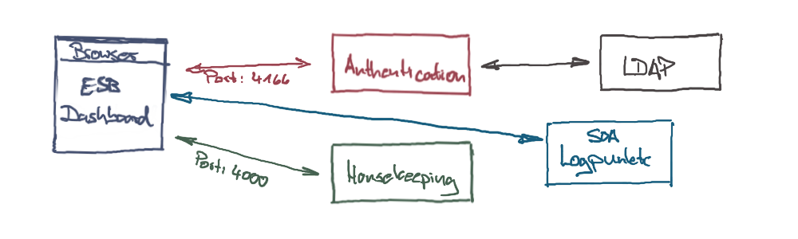
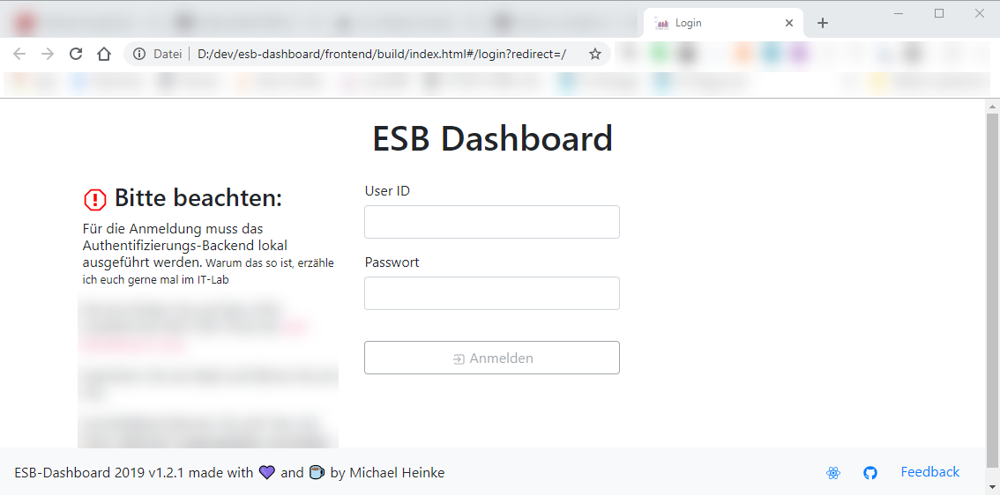
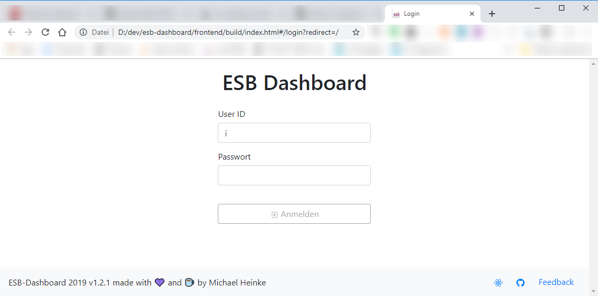

# SOA-Dashboard

[](https://app.fossa.com/projects/git%2Bgithub.com%2Fh9h%2Fsoa-dashboard?ref=badge_large)

[FOSSA-Report](https://app.fossa.com/reports/676a814b-3ee3-45ac-9f49-b5f28b2f45ff)

## Überblick

Das Projekt besteht aus zwei Teilen:

- einem React Frontend
- einem kleinem Server Backend für die Authentifizierung
- und optional einem kleinen Server Backend für Housekeeping-Jobs in der SOA (z.B. Resend von Nachrichten)

Das Frontend liegt im Verzeichnis <code>./frontend</code>. Hierbei handelt es sich um ein
gewöhnliches [CRA-Projekt](https://github.com/facebook/create-react-app), welches eine Single Page App realisiert.

Die Backends sind [KOA-Server](https://koajs.com/):

- <code>./server.js</code> bietet eine REST-Schnittstelle zur LDAP-Authentifizierung
- <code>./backend-jobs/server.js</code> liefert eine API für's Housekeeping

Working Demo: [hier](https://h9h.github.io) User = Password = testuser

#### Warum überhaupt ein Backend?

Die Authentifizierung findet gegen ActiveDirectory/LDAP statt. Ich habe kein NPM-Modul gefunden, welches nicht
von dem [Net-Modul](https://nodejs.org/api/net.html) aus node abhängig wäre. Das steht offensichtlich im Browser
nicht zur Verfügung.

Eine Eigenimplementierung kam für mich nicht in Frage. Daher brauchte ich einen Node.js Prozess, der
die Authentifizierung abhandelt.

Die API für's Housekeeping bietet einen Zugriff auf lokale Verzeichnisse: zum einen für die Definition und Logs der
Housekeeping.Jobs, zum anderen um darüber für das Housekeeping benötigte Modell-Informationen bereit zu stellen.

### High-Level Architektur

Für das ESB-Dashboard spielen verschiedene Komponenten zusammen:



Basis für die Daten des Dashboards sind die Logpunkte aus der SOA, die für die verschiedenen Laufzeitumgebungen der
SOA über eine REST-Schnittstelle angebunden werden (siehe blauen Kasten). Die Authentifizierung des Nutzers erfolgt
über einen REST-Call gegen den roten Kasten, der selbst wiederum das LDAP/ActiveDirectory anspricht.

### Installation und Customising

1: Hole Sourcen:

```
git clone https://github.com/h9h/soa-dashboard.git
```

2: Lege Customising-Dateien in den Ordnern

```
./customisation
```

und

```
./frontend/src/customisation
```

entsprechend der dort liegenden README.md an:

- [Backend Customisation Readme](./customisation/README.md)
- [Frontend Customisation Readme](./frontend/src/customisation/README.md)

3: Lege im Ordner

```
./frontend
```

eine ```.env``` gemäß dem Beispiel ```.env.example``` an.

4: ```yarn install``` einmal auf Ebene des Projektes und einmal im Ordner ```frontend```.

### Skripte

In der <code>./package.json</code> sind verschiedene Skripte definiert:

#### Für die Entwicklung

```
yarn start

```

startet sowohl einen Hot-Loading Server für das Frontend, welches dann unter <code><http://localhost:3000></code>
verfügbar ist. Des Weiteren werden die Backends für Authentication und Housekeeping gestartet. Diese laufen
standardmäßig unter Port 4166 bzw. 4000.

Alternativ können die drei Komponenten einzeln gestartet werden - dies ist sinnvoll, wenn man in der Entwicklung
ein Backend durchstarten möchte, ohne immer das Frontend mit zu starten:

```
yarn ncc:server:auth
yarn ncc:server:file
yarn start:frontend
```

#### Für das Erzeugen der Artefakte mit Node-Backend

```
yarn build
```

baut die Frontend-SPA unter <code>./frontend/build</code>. Ein Aufruf der <code>index.html</code> aus dem
Build-Verzeichnis im Browser ergibt folgenden Zustand nach erfolgreichem Bau:


Auf der linken Seite ist ein Stop-Symbol und individueller Text zu sehen. Dies zeigt an, dass das Authentifizierungs-
Backend nicht ereichbar ist.

```
yarn ncc:build
```

erzeugt unter <code>./dist</code> zwei Verzeichnisse - "auth" und "file" - die jeweils eine <code>index.js</code>
enthalten. Dieses sind fertig gebundelte JavaScript-Sourcen für die Backends.

Das Authentifizierungsbackend kann dann mittels ```node ./dist/auth``` gestartet werden. Danach verschwindet das
Stop-Symbol:

  
#### Für das Erzeugen der Artefakte mit Binary-Backend

Das Frontend wird wieder mit ```yarn build``` gebaut. Die Backends werden mittels

```
yarn pkg:server:dashboard
yarn pkg:server:file
```

als Windows-EXEs bereit gestellt.

Ein potentieller Betriebsmodus wäre dann, lokal <code> esb-dashboard.exe</code> zu starten, da diese sowohl das
Frontend, als auch das Authentifizierungs-Backend bereit stellt. Das Dashboard steht dann unter
<code>http:/localhost:4166</code> zur Verfügung.

#### Alles zusammen

Mittels

```
yarn build:all
```

werden

1. das Frontend gebundelt
1. die esb-dashboard.exe und esb-jobs.exe erzeugt
1. die Javascripte für Auth- und Jobs-Backend gebundelt
1. und das gebundelte Auth-Javascript mit in das frontend/build-Verzeichnis kopiert.

Damit reicht es dann, das frontend/build Verzeichnis an den gewünschten Ort auf dem Server zu deployen und den Start
von ```node ./auth.js``` in den Start des Servers einzubinden.
Für den Stopp des Authentifizierungs-Backends reicht ein kill auf den Prozess. Es wird kein Zustand gehalten.

### Hinweise

##### zeit/pkg

Hinter einem Proxy funktioniert das Herunterladen der Binaries für die Packages nicht.
Dies äußert sich dadurch, dass der Bauschritt `pkg:server:dashboard` abbricht.
Die Fehlermeldung ist in der Log-Datei output-dashboard-win-pkg.log zu finden.
Dort ist auch der Name der Datei zu finden, die im folgenden Workaround dann manuell herunterzuladen ist.

Daher dieser Workaround:

(hier für v2.6, ansonsten entsprechende Version jeweils anpassen - siehe `tag` in der Logdatei)

1. gehe zu <https://github.com/vercel/pkg-fetch/releases/>
1. such die passende Version gemäß der Fehlermeldung in der Logdatei `output-...-pkg.log`
1. Download die gewünschte Version gemäß Log-Datei
1. Gehe zum ./pkg-cache Verzeichnis (bei mir: C:\Users\\{userid}\\.pkg-cache\v2.6)
1. Kopiere das heruntergeladene Bin
1. Benenne den Anfang der Datei um zu "fetched-..."
1. Versuche pkg Skript noch einmal, sollte dann funktionieren
