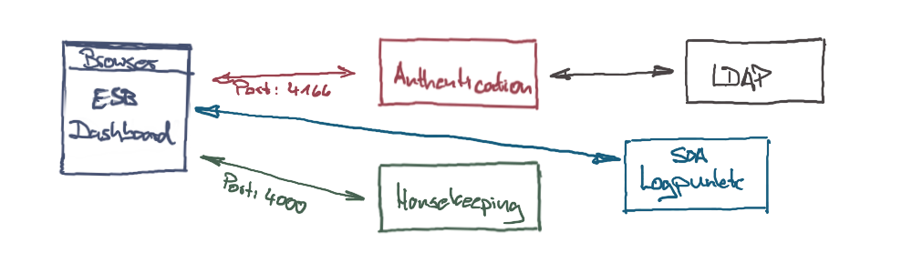
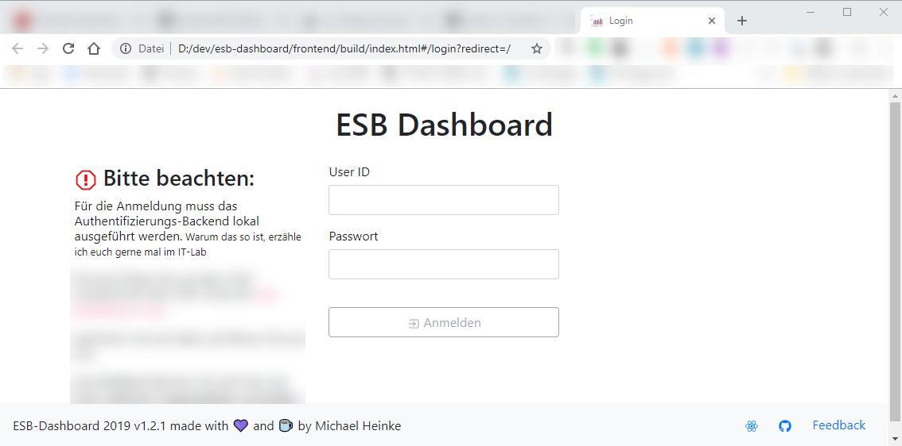
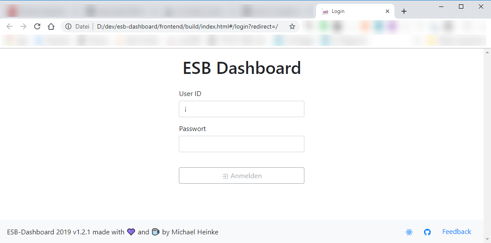

# SOA-Dashboard

[](https://app.fossa.com/projects/git%2Bgithub.com%2Fh9h%2Fsoa-dashboard?ref=badge_large)

[FOSSA-Report](https://app.fossa.com/reports/676a814b-3ee3-45ac-9f49-b5f28b2f45ff)

## Überblick

Das Projekt besteht aus zwei Teilen:

- einem React Frontend (`./frontend`)
- einem kleinen Server Backend für die Authentifizierung (`./backend-auth`)

Das Frontend liegt im Verzeichnis `./frontend`. Hierbei handelt es sich um ein
gewöhnliches [CRA-Projekt](https://github.com/facebook/create-react-app), welches eine Single Page App realisiert.

Das Backend ist ein [KOA-Server](https://koajs.com/): `./backend-auth/server.js` bietet eine
REST-Schnittstelle zur LDAP-Authentifizierung.

Das optionale Backend für die Housekeeping-Jobs der SOA liegt seit der Go-Portierung im eigenen
Projekt [`soa-dashboard-jobs`](../soa-dashboard-jobs). Das Protokoll ist unverändert — die
Oberfläche spricht ohne Anpassung mit dieser Fassung.

Working Demo: [hier](https://h9h.github.io) User = Password = testuser

#### Warum überhaupt ein Backend?

Die Authentifizierung findet gegen ActiveDirectory/LDAP statt. Ich habe kein NPM-Modul gefunden, welches nicht
von dem [Net-Modul](https://nodejs.org/api/net.html) aus node abhängig wäre. Das steht offensichtlich im Browser
nicht zur Verfügung.

Eine Eigenimplementierung kam für mich nicht in Frage. Daher brauchte ich einen Node.js Prozess, der
die Authentifizierung abhandelt.

Die API für's Housekeeping — Zugriff auf lokale Verzeichnisse für Jobdefinitionen, Logs und
Modell-Informationen — braucht kein Node und ist deshalb ausgelagert (siehe oben).

### High-Level Architektur

Für das ESB-Dashboard spielen verschiedene Komponenten zusammen:



Basis für die Daten des Dashboards sind die Logpunkte aus der SOA, die für die verschiedenen Laufzeitumgebungen der
SOA über eine REST-Schnittstelle angebunden werden (siehe blauen Kasten). Die Authentifizierung des Nutzers erfolgt
über einen REST-Call gegen den roten Kasten, der selbst wiederum das LDAP/ActiveDirectory anspricht.

Eine ausführliche Architekturbeschreibung mit C4-Diagrammen (Context, Container, Component,
Deployment) sowie den Laufzeitsichten für Login, Logpunkt-Abfrage und Resend findet sich in
[ARCHITECTURE.md](./ARCHITECTURE.md).

### Installation und Customising

#### 1. Repository klonen

```bash
git clone https://github.com/h9h/soa-dashboard.git
cd soa-dashboard
```

#### 2. Abhängigkeiten installieren

```bash
npm install
cd frontend && npm install && cd ..
```

#### 3. Konfiguration einrichten

Führe das Setup-Script aus, um Beispiel-Konfigurationsdateien zu kopieren:

```bash
npm run setup
```

Dies erstellt Konfigurationsdateien im Ordner `./customisation` basierend auf den Beispielen in `./config`.

Bearbeite die Dateien in `./customisation`:
- `authentication.config.js` - LDAP/AD-Einstellungen
- `authenticationImplementation.js` - Authentifizierungsstrategie
- `resend-users.config.js` - Benutzer mit Resend-Rechten (optional)

#### 4. Frontend-Konfiguration

Lege im Ordner `./frontend` eine `.env` gemäß dem Beispiel `.env.example` an.

```bash
cp frontend/.env.example frontend/.env
```

Bearbeite `frontend/.env` mit deinen Einstellungen.

#### 5. Entwicklungsserver starten

```bash
npm start
```

Dies startet:
- Frontend: http://localhost:3000
- Auth-Backend: http://localhost:4166

Das Jobs-Backend (http://localhost:4000) wird bei Bedarf separat aus
[`soa-dashboard-jobs`](../soa-dashboard-jobs) gestartet.

### Skripte

In der `./package.json` sind verschiedene Skripte definiert:

#### Setup und Konfiguration

```bash
npm run setup           # Erstelle Beispiel-Konfigurationsdateien
npm run backup:config   # Sichere aktuelle Konfiguration
npm run lint            # Prüfe Code-Qualität (Backend)
npm run lint:fix        # Fixe Code-Qualität automatisch
```

#### Für die Entwicklung

```bash
npm start               # Starte Frontend + Auth-Backend
npm run start:frontend  # Nur Frontend
npm run start:auth      # Nur Auth-Backend
```

Startet sowohl einen Hot-Loading Server für das Frontend unter `http://localhost:3000`,
als auch das Authentifizierungs-Backend (standardmäßig Port 4166).

#### Für das Erzeugen der Artefakte

```bash
npm run build           # Baut nur das Frontend
npm run ncc:build       # Bundelt das Auth-Backend als JS
npm run build-auth      # dito, mit anschließendem Kopieren nach frontend/build
```

`npm run build` baut die Frontend-SPA unter `./frontend/build`. Ein Aufruf der `index.html` aus dem
Build-Verzeichnis im Browser ergibt folgenden Zustand nach erfolgreichem Bau:



Auf der linken Seite ist ein Stop-Symbol und individueller Text zu sehen. Dies zeigt an, dass das Authentifizierungs-
Backend nicht erreichbar ist.

`npm run ncc:build` erzeugt unter `./dist/auth` eine `index.js`. Dieses ist die fertig gebundelte
JavaScript-Source des Auth-Backends.

Das Authentifizierungsbackend kann dann mittels `node ./dist/auth` gestartet werden. Danach verschwindet das
Stop-Symbol:



⚠ Das Stop-Symbol verschwindet nur dann, wenn der Build mit `REACT_APP_USE_LOCAL_AUTHENTICATION=true` erzeugt wurde.
Ein Deployment-Build (Flag nicht gesetzt) ruft die Authentifizierung unter `<protocol>//<hostname>/api` auf — beim
Öffnen der `index.html` von der Platte also unter `file:///api`. Siehe
[Lokales Testen des Builds](#lokales-testen-des-builds).


#### Alles zusammen

Mittels

```bash
npm run build:all
```

werden

1. die Konfiguration gesichert
2. das Frontend gebaut
3. das Javascript für das Auth-Backend gebundelt
4. und das gebundelte Auth-Javascript mit in das frontend/build-Verzeichnis kopiert.

Damit reicht es dann, das `frontend/build` Verzeichnis an den gewünschten Ort auf dem Server zu deployen und den Start
von `node ./auth.js` in den Start des Servers einzubinden.

Für den Stopp des Authentifizierungs-Backends reicht ein kill auf den Prozess. Es wird kein Zustand gehalten.

#### Lokales Testen des Builds

Die SPA legt die URL des Auth-Backends zur **Bauzeit** fest
(`frontend/src/logic/api/rest-api-local.js`):

| `REACT_APP_USE_LOCAL_AUTHENTICATION` | URL der Authentifizierung |
|---|---|
| `true` | `http://localhost:4166` (bzw. `REACT_APP_AUTHENTICATION_PORT`) |
| nicht gesetzt (Deployment) | `<protocol>//<hostname>/api` — **ohne Portangabe** |

Das Jobs-Backend wird in beiden Fällen direkt unter `http://localhost:4000` angesprochen.

Ein Deployment-Build lässt sich deshalb nicht durch einfaches Öffnen der `index.html` testen: der Login ginge
gegen `file:///api`. Für einen realistischen Test gibt es

```bash
npm run serve:build          # http://localhost + Proxy /api -> localhost:4166
npm run serve:build 8099     # abweichender Port (Login schlägt dann fehl, s.u.)
```

`scripts/serve-build.js` liefert `frontend/build` statisch aus und leitet `/api` an das Auth-Backend weiter —
also genau die Konstellation, die im Deployment der Webserver herstellt. Der Auth-Port wird aus
`customisation/authentication.config.js` (`LOCAL_SERVER_PORT`) gelesen, optional als zweites Argument
überschreibbar.

Der komplette lokale Test:

```bash
npm run build                # oder npm run build:all
npm run start:auth           # in einer zweiten Konsole (alternativ: node ./dist/auth)
npm run serve:build          # in einer dritten Konsole, als Administrator
```

Weil der gebaute Bundle die Authentifizierung ohne Portangabe aufruft, **muss** der Build-Server auf Port 80
laufen. Unter Windows erfordert das eine Konsole mit Administratorrechten; ist der Port belegt (IIS, http.sys),
zeigt `netstat -ano | findstr :80` den Verursacher.

Ohne Administratorrechte bleibt der schnelle Weg: einmalig mit gesetztem Flag bauen, dann genügt jeder Port —
oder sogar die `index.html` von der Platte:

```bash
cd frontend
set REACT_APP_USE_LOCAL_AUTHENTICATION=true && npm run build    # PowerShell: $env:REACT_APP_USE_LOCAL_AUTHENTICATION="true"
```

Ein so gebautes Artefakt zeigt auf `localhost` und darf **nicht** deployt werden.
